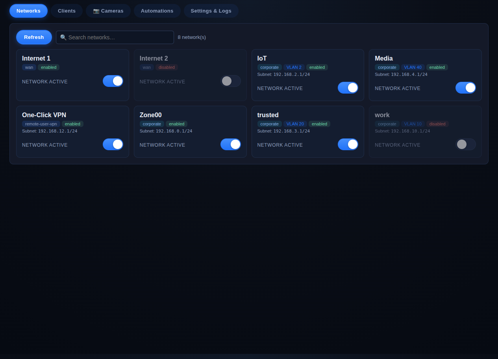
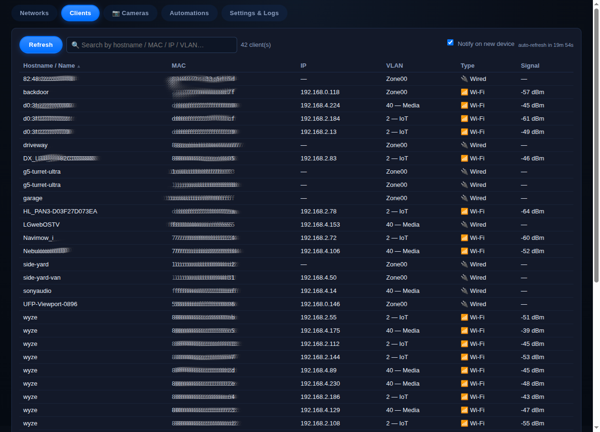
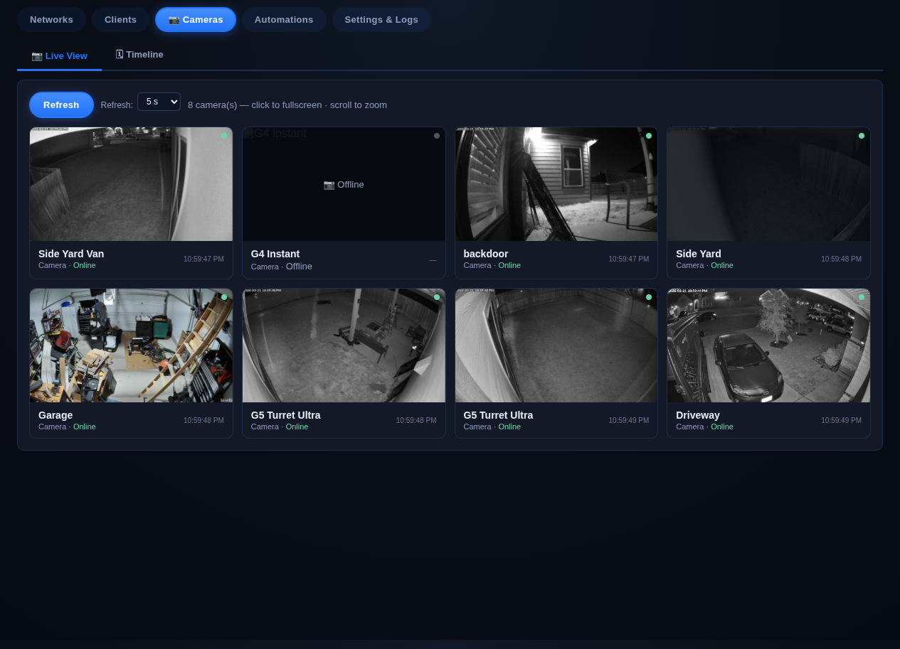
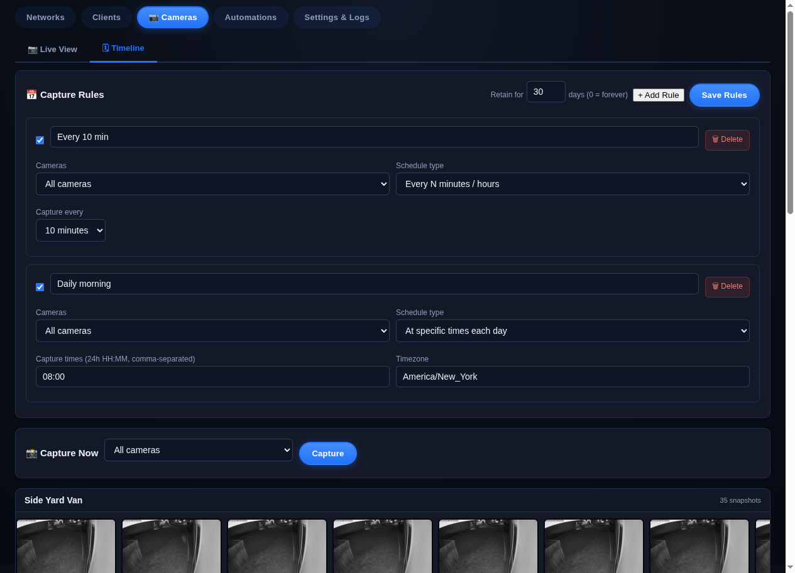
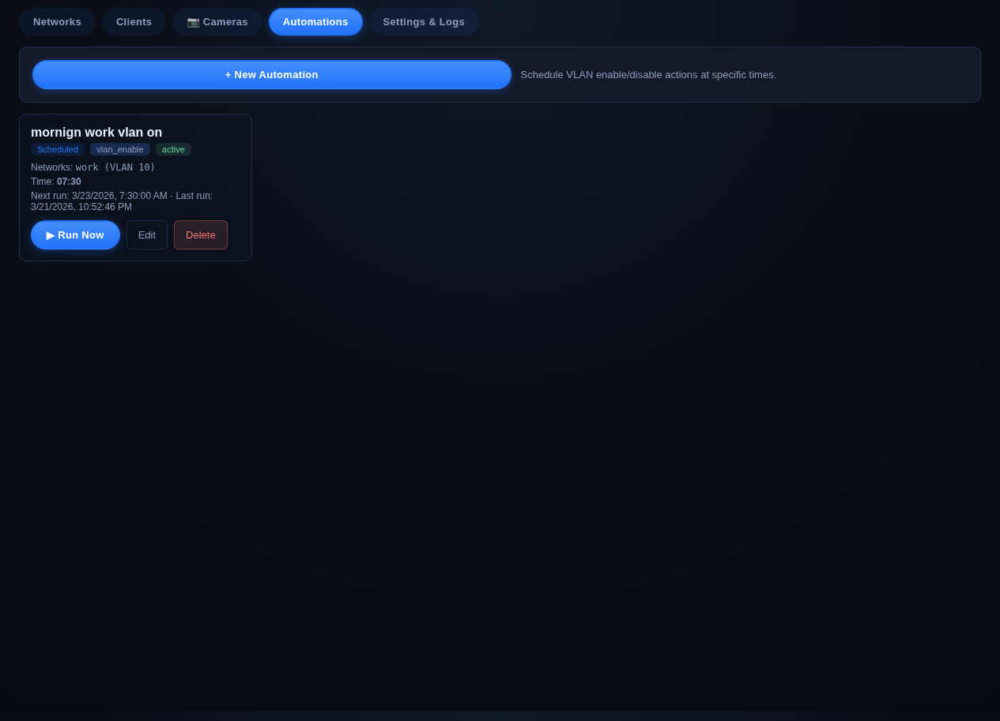
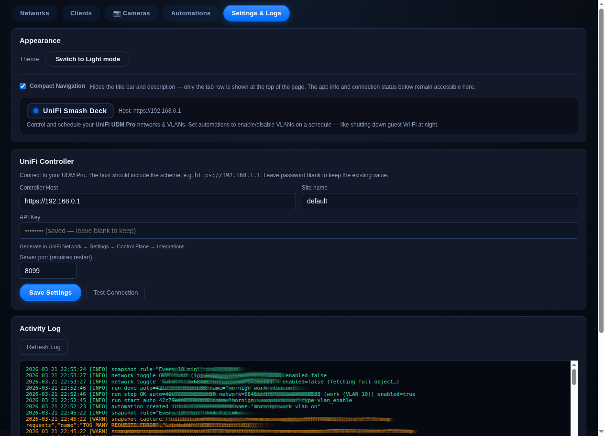

# UniFi Smash Deck

A self-hosted web dashboard for managing and monitoring a **UniFi UDM Pro** (or any UniFi OS device).  Written in Go with a zero-dependency frontend — a single binary serves both the API and the UI.


---

## Screenshots

### Networks
View and toggle all your VLANs and networks with a single click.



### Clients
Live client list with sortable columns, VLAN name resolution, search, and new-device alerts.



### Cameras — Live View
Auto-refreshing snapshot grid for all UniFi Protect cameras. Click any image to open a full-screen lightbox. Scroll to zoom and pan within the grid.



### Cameras — Timeline
Schedule recurring snapshot captures (interval or daily times, per camera or all cameras). Browse thumbnail strips and play back a slideshow for any camera.



### Automations
Schedule VLANs to enable or disable on a recurring basis — supports specific times, days of week, timezone, skip-weekends, and end dates.



### Settings & Logs
Configure your UniFi host, API key, site, and port. The live activity log shows every automation run, network toggle, and snapshot capture.



---

## Features

| Tab | What it does |
|-----|-------------|
| **Networks** | List VLANs/networks, enable or disable them with one click |
| **Clients** | Live connected-device list with sortable columns (hostname, MAC, IP, VLAN, type, signal), VLAN name lookup, search, 20-minute auto-refresh, new-device alert card with dismiss and OS notifications |
| **Cameras → Live View** | Snapshot grid for all UniFi Protect cameras; adjustable refresh rate (5 s – 30 s); click to fullscreen; scroll to zoom/pan in the grid; always fetches highest-quality image |
| **Cameras → Timeline** | Flexible snapshot scheduling (interval or fixed daily times, per camera or all); thumbnail strip per camera; slideshow playback at up to 30 fps with adjustable speed |
| **Automations** | Schedule network enable/disable with days-of-week, timezone, skip-weekends, and end-date support |
| **Settings & Logs** | Configure host, API key, site, and port; live activity log; light/dark theme; compact navigation mode |

---

## Quick Start (Docker)

```bash
# 1. Copy the compose file onto your NAS / server
curl -O https://raw.githubusercontent.com/niski84/unifi-smash-deck/main/docker-compose.yml

# 2. Start it
docker compose up -d

# 3. Open the UI
open http://<your-server-ip>:8099
```

Then go to the **Settings & Logs** tab and enter your:
- **UniFi Host** — e.g. `https://192.168.0.1`
- **API Key** — created in UniFi OS under *Settings → Control Plane → Integrations*
- **Site** — usually `default`

### Updating

Settings and automations are stored in a named Docker volume (`unifideck-data`) and survive upgrades:

```bash
docker compose pull && docker compose up -d
```

> **Warning:** `docker compose down -v` deletes the volume and all your data.  
> Use plain `docker compose down` when stopping or redeploying.

---

## Building from Source

Requires Go 1.22+.

```bash
git clone https://github.com/niski84/unifi-smash-deck.git
cd unifi-smash-deck

# Run locally (serves on :8099)
go run ./cmd/unifideck

# Or use the reload helper
./scripts/reload.sh
```

Configuration is read from the Settings UI or from environment variables / `.env`:

```bash
cp .env.example .env
# Edit .env if you want env-var overrides; otherwise leave it as-is and use the UI
```

---

## Building the Docker Image

```bash
# Local build (current platform)
./scripts/docker-build.sh

# Multi-platform (amd64 + arm64) and push to GHCR
./scripts/docker-build.sh --push
```

The included GitHub Actions workflow (`.github/workflows/build.yml`) builds and pushes a multi-arch image to `ghcr.io/niski84/unifi-smash-deck` on every push to `main` and on version tags (`v*.*.*`).

---

## Deploying to a NAS via SSH

```bash
NAS_HOST=192.168.0.x NAS_USER=admin NAS_DEPLOY_DIR=/volume1/docker/unifideck \
  ./scripts/deploy-nas.sh
```

---

## Architecture

```
cmd/unifideck/main.go          ← entry point, signal handling
internal/unifideck/
  config.go                    ← AppConfig, load/save settings
  unifi_client.go              ← HTTP client for UniFi Network + Protect APIs
  automation.go                ← automation types, scheduler, store, logger
  snapshot_store.go            ← scheduled snapshot capture, storage, index
  client_tracker.go            ← persistent client history, new-device detection
  http_server.go               ← route wiring, thin handlers
web/
  embed.go                     ← //go:embed — static assets baked into binary
  unifideck/index.html         ← single-page UI (vanilla JS, no build step)
```

- **Backend:** Go stdlib only (`net/http`, `encoding/json`) — no web framework.
- **Frontend:** Vanilla JS + `fetch` — no bundler, no npm.
- **Persistence:** JSON files in `./data/` (or `$DATA_DIR`).
- **Auth:** UniFi local API key via `X-API-KEY` header — no session cookies.

---

## UniFi API Key

Create the key in your UDM Pro under:

> **UniFi OS → Settings → Control Plane → Integrations → Add API Key**

The same key works for both the Network API (VLANs/automations) and the Protect API (cameras/snapshots).

---

## Data Backup

All persistent data lives in the `unifideck-data` Docker volume:

```bash
# Backup
docker run --rm \
  -v unifideck-data:/data \
  -v $(pwd):/backup \
  alpine tar czf /backup/unifideck-backup.tar.gz -C /data .

# Restore
docker run --rm \
  -v unifideck-data:/data \
  -v $(pwd):/backup \
  alpine tar xzf /backup/unifideck-backup.tar.gz -C /data
```

---

## License

MIT
